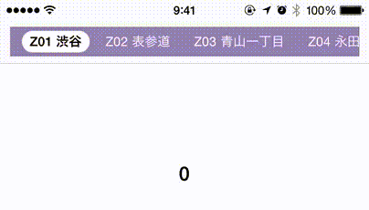
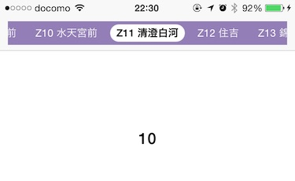

# USGScrollingTabBar

 

Swift 版：[USGScrollingTabBar_Swift](https://github.com/usagimaru/USGScrollingTabBar_Swift)

Objective-C 版はもうメンテしません。

USGScrollingTabBar は iOS 向けのスクロールタブバー部品の実装です。Objective-C で書かれています。
他のスクロールビューと連動したタブのスクロールが可能です。その際、選択状態のタブは中心に留まるように調整されます。また、タブバー自体は独立してスクロールすることも可能です。タブ幅は文字列に合わせて可変的に調整されます。

次の項目がカスタマイズ可能です：

- タブバーの背景色
- タブバーの左右余白
- タブ間隔
- タブの内側余白
- フォーカスの角丸半径
- フォーカスの上下余白
- フォーカスの背景色
- 減速度
- 通常、ハイライト、選択それぞれに属性付き文字列を設定可能

# 使い方

Interface Builder にカスタム UIView を配置するか、プログラムコードで直接初期化してください。

```objc
USGScrollingTabBar *scrollingTabBar = [[USGScrollingTabBar alloc] initWithFrame:CGRectMake(0,0,100,40)];
[view addSubView:scrollingTabBar];
```

## タブ項目を用意する

次に `USGScrollingTabItem` が必要になります。このクラスは NSAttributedString で表現されるタイトル、通常状態、ハイライト状態、選択状態の3種類を持つことになります。

```objc
NSAttributedString *string = [USGScrollingTabItem attributedStringFromString:title
																		font:font
																   textColor:color
															   textAlignment:NSTextAlignmentCenter
															   lineBreakMode:NSLineBreakByTruncatingTail];
USGScrollingTabItem *tabItem = [USGScrollingTabItem tabItemWithString:string];
```

用意したタブ項目で `USGScrollingTabBar` をリロードします。
```objc
[scrollingTabBar reloadTabItems:tabItems];
```

## USGScrollingTabBarDelegate

タブを選択したときのイベントは `USGScrollingTabBarDelegate` で定義されるメソッドで受け取ることができます。

```objc
- (void)scrollingTabBar:(USGScrollingTabBar*)tabBar didSelectTabAtIndex:(NSUInteger)index
{
	[scrollView setContentOffset:CGPointMake(scrollView.frame.size.width * index, scrollView.contentOffset.y)
						animated:YES];
}
```

# ライセンス

MIT license でライセンスしています。詳細は LICENSE ファイルを読んでください。


----

# USGScrollingTabBar (English)

 

Swift Version: [USGScrollingTabBar_Swift](https://github.com/usagimaru/USGScrollingTabBar_Swift)

This Objective-C project is no longer maintenance.

USGScrollingTabBar is a scrolling tab bar component for iOS written in Objective-C.
It is scroll by synchronized with another UIScrollView. Then the selection tab will be adjusted at the center point.
The tab bar can also be scrolled independently. Tab widths are adjusted dynamically to the content of string.

The following items can be customized:

- Tab bar background color
- Left and right margins of the tab bar
- Tab spacing
- Inner margins of tabs
- Corner radius of the focus
- Top and bottom margins of the focus
- Background color of the focus
- Deceleration rate of scrolling
- Can set NSAttributedString to each tab states, normal, highlighted, and selected

# Usage

Install custom UIView on Interface Builder or initialize programmatically.

```objc
USGScrollingTabBar *scrollingTabBar = [[USGScrollingTabBar alloc] initWithFrame:CGRectMake(0,0,100,40)];
[view addSubView:scrollingTabBar];
```

## Create Tab Items

To use, you need `USGScrollingTabItem` items. This class has properties NSAttributedString titles. So you should set NSAttributedString strings each 3 states, normal state, highlighted state and selected state.

```objc
NSAttributedString *string = [USGScrollingTabItem attributedStringFromString:title
																		font:font
																   textColor:color
															   textAlignment:NSTextAlignmentCenter
															   lineBreakMode:NSLineBreakByTruncatingTail];
USGScrollingTabItem *tabItem = [USGScrollingTabItem tabItemWithString:string];
```

Reload `USGScrollingTabBar` with tab items.
```objc
[scrollingTabBar reloadTabItems:tabItems];
```

## USGScrollingTabBarDelegate

You can responds to tab selection event. This method is defined by `USGScrollingTabBarDelegate`.

```objc
- (void)scrollingTabBar:(USGScrollingTabBar*)tabBar didSelectTabAtIndex:(NSUInteger)index
{
	[scrollView setContentOffset:CGPointMake(scrollView.frame.size.width * index, scrollView.contentOffset.y)
						animated:YES];
}
```

# License

This project is under the MIT license. See LICENSE for details.
